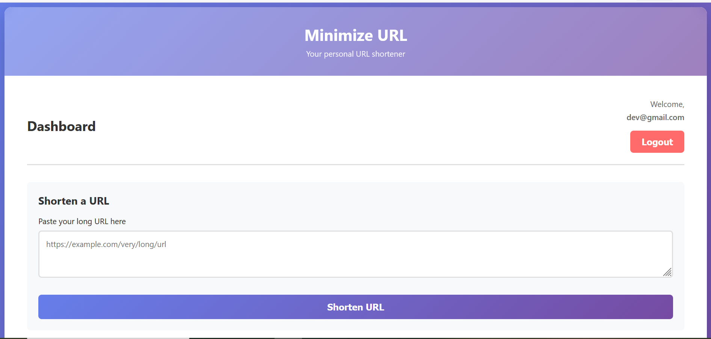
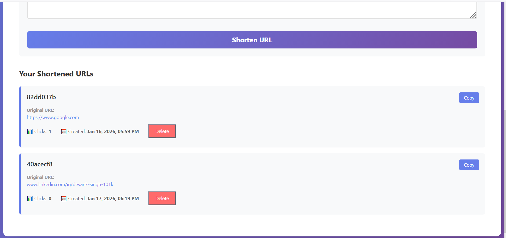

# Minimize URL Spring Boot

A Spring Boot application that provides URL shortening functionality with JWT-based authentication. Users can create short codes for long URLs and track access counts.

## Features

- **URL Shortening**: Convert long URLs into short, shareable codes
- **JWT Authentication**: Secure user authentication with JWT tokens
- **Access Tracking**: Monitor how many times each shortened URL is accessed
- **User Management**: Register new users and manage user accounts
- **H2 Database**: Embedded database for development and testing

## Screenshots

### Home Page


### URL Management


## Project Structure

```
src/
├── main/
│   ├── java/com/example/minimizeurlspringboot/
│   │   ├── config/
│   │   │   └── SecurityConfig.java           # Spring Security configuration
│   │   ├── controller/
│   │   │   ├── AuthControlller.java          # Login and signup endpoints
│   │   │   ├── HomeController.java           # Home endpoint
│   │   │   └── ShortUrlController.java       # URL shortening endpoints
│   │   ├── dto/
│   │   │   ├── AuthRequest.java              # Authentication request DTO
│   │   │   ├── AuthResponse.java             # Authentication response DTO
│   │   │   ├── ShortUrlRequest.java          # Short URL request DTO
│   │   │   └── ShortUrlResponse.java         # Short URL response DTO
│   │   ├── models/
│   │   │   ├── User.java                     # User entity
│   │   │   └── ShortUrl.java                 # Short URL entity
│   │   ├── repository/
│   │   │   ├── UserRepository.java           # User database operations
│   │   │   └── ShortUrlRepository.java       # Short URL database operations
│   │   ├── security/
│   │   │   ├── JwtUtil.java                  # JWT token utilities
│   │   │   └── JwtAuthFilter.java            # JWT authentication filter
│   │   ├── service/
│   │   │   ├── UserService.java              # User business logic
│   │   │   └── ShortUrlService.java          # URL shortening business logic
│   │   └── MinimizeUrlSpringbootApplication.java
│   └── resources/
│       └── application.properties             # Configuration file
└── test/
    └── java/...                               # Unit tests
```

## Technology Stack

- **Java 17**: Programming language
- **Spring Boot 4.0.1**: Application framework
- **Spring Security**: Authentication and authorization
- **Spring Data JPA**: ORM for database operations
- **H2 Database**: Embedded relational database
- **JWT (jjwt 0.11.5)**: JSON Web Token for authentication
- **Lombok**: Reduce boilerplate code
- **Maven**: Build tool

## API Endpoints

### Authentication

#### Sign Up
```http
POST /auth/signup
Content-Type: application/json

{
  "username": "johndoe",
  "email": "john@example.com",
  "password": "securePassword123"
}
```

Response:
```json
{
  "message": "User registered successfully",
  "token": "eyJhbGciOiJIUzI1NiJ9...",
  "tokenType": "Bearer"
}
```

#### Login
```http
POST /auth/login
Content-Type: application/json

{
  "email": "john@example.com",
  "password": "securePassword123"
}
```

Response:
```json
{
  "message": "User registered successfully",
  "token": "eyJhbGciOiJIUzI1NiJ9...",
  "tokenType": "Bearer"
}
```

### URL Shortening

#### Create Short URL
```http
POST /url/short
Authorization: Bearer {token}
Content-Type: application/json

{
  "originalUrl": "https://www.example.com/very/long/url/path"
}
```

Response:
```json
{
  "originalUrl": "https://www.example.com/very/long/url/path",
  "shortUrl": "http://localhost:8080/a1b2c3d4"
}
```

#### Redirect to Original URL
```http
GET /{shortCode}
```

This endpoint redirects to the original URL and increments the access count.

### Home

#### Welcome
```http
GET /
```

Response:
```
Welcome to Minimize-URL
```

## Configuration

Configuration is managed in `src/main/resources/application.properties`:

```properties
# Server Configuration
spring.application.name=minimize-url-springboot
server.port=8080

# H2 Database Configuration
spring.datasource.driver-class-name=org.h2.Driver
spring.datasource.url=jdbc:h2:file:./mydb
spring.datasource.username=sa
spring.datasource.password=123456

# H2 Console
spring.h2.console.enabled=true
spring.h2.console.path=/h2-console

# JPA/Hibernate Configuration
spring.jpa.database-platform=org.hibernate.dialect.H2Dialect
spring.jpa.hibernate.ddl-auto=update
spring.jpa.show-sql=true

# Logging
logging.level.org.springframework.security=DEBUG

# JWT Configuration
jwt.secret=ThisIsAReallyStrongJwtSecretKeyWithMoreThan32Chars123!
jwt.expiration=3600000
```

## Getting Started

### Prerequisites

- Java 17 or higher
- Maven 3.6 or higher

### Build

```bash
./mvnw clean package
```

### Run

```bash
./mvnw spring-boot:run
```

The application will start on `http://localhost:8080`

### Database

H2 Console is available at: `http://localhost:8080/h2-console`

**Credentials:**
- JDBC URL: `jdbc:h2:file:./mydb`
- Username: `sa`
- Password: `123456`

## Security Features

- **JWT Authentication**: All endpoints except `/auth/**`, `/h2-console/**`, and `/{shortCode}` require a valid JWT token
- **Password Encoding**: User passwords are encrypted using BCrypt
- **CSRF Protection**: Disabled for API usage
- **Frame Options**: Disabled to allow H2 Console access

## Entity Relationships

### User Entity
- **ID**: Primary key (auto-generated)
- **Username**: Unique username
- **Email**: Unique email address
- **Password**: BCrypt-encoded password
- **CreatedAt**: Timestamp of account creation

### ShortUrl Entity
- **ID**: Primary key (auto-generated)
- **OriginalUrl**: The long URL being shortened (up to 2048 characters)
- **ShortCode**: Unique 8-character code generated from UUID
- **CreatedAt**: Timestamp of short URL creation
- **AccessCount**: Number of times the short URL has been accessed
- **User**: Reference to the User who created it (Many-to-One relationship)

## How It Works

1. **User Registration/Login**: Users create an account or log in to receive a JWT token
2. **Create Short URL**: Authenticated users send their long URL to the `/url/short` endpoint
3. **Generate Short Code**: The service generates a unique 8-character code from a UUID
4. **Store and Return**: The short URL is saved to the database with user association
5. **Redirect**: When someone accesses the short code, they are redirected to the original URL and the access count is incremented

## Error Handling

The application throws `RuntimeException` for:
- User not found
- Email already exists
- Invalid credentials
- Short URL not found

## Future Enhancements

- [ ] Add expiration dates for short URLs
- [ ] Implement custom short codes
- [ ] Add analytics/statistics endpoint
- [ ] Implement rate limiting
- [ ] Add OpenAPI/Swagger documentation
- [ ] Add Redis caching for frequently accessed URLs
- [ ] Implement URL validation
- [ ] Add QR code generation

## License

This project is licensed under the Apache License 2.0

## Authors

- Developer